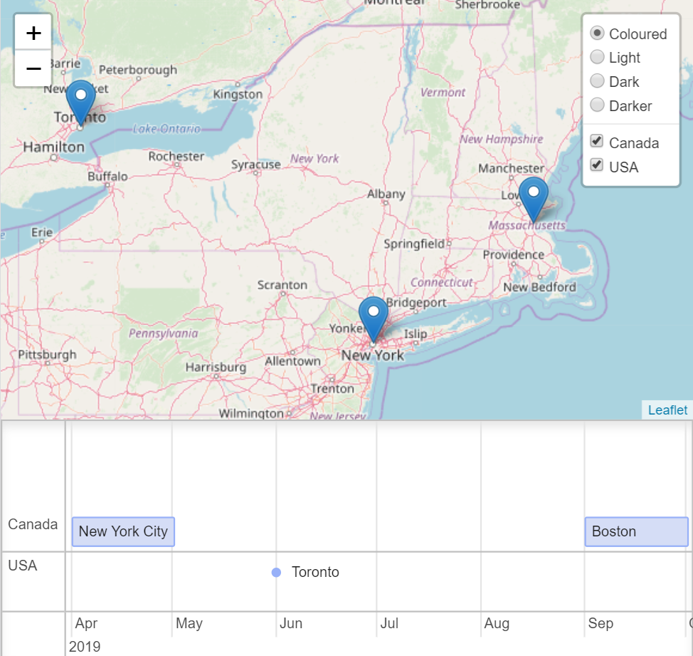

# chronomap

Provides functionality for syncing and interacting with a `leaflet` map and a `vis-timeline`. 



## Docs

* https://puiutucutu.github.io/chronomap/

## Features

* sync leaflet marker layers with timeline groups
* synced layer toggling
* pan to timeline item on marker click
* pan map to marker on timeline item click
* hooks for manually panning timeline and map to marker

## Use

### Browser

Import the `./dist/chronomap.umd.js` file into the browser and access it via the snake case `chronoMap` window global.

See the following examples.

* `./examples/browser/es6-module/index.html`
* `./examples/browser/umd/index.html`

### Node

```
npm install chronomap
```

Only one export is provided. See examples and docs for usage.

```
import { Chronomap } from "chronomap";
```

### Development

```
npm run start
```

Outputs a bundled build in the `./development/dist` folder and serves the `
./development/index.html` file locally. 

## Todo

- [ ] add tests 
- [x] reduce bundle size by making `leaflet` and `vis-timeline` external requirements
- [ ] extract functionality to interop with other mapping libraries
